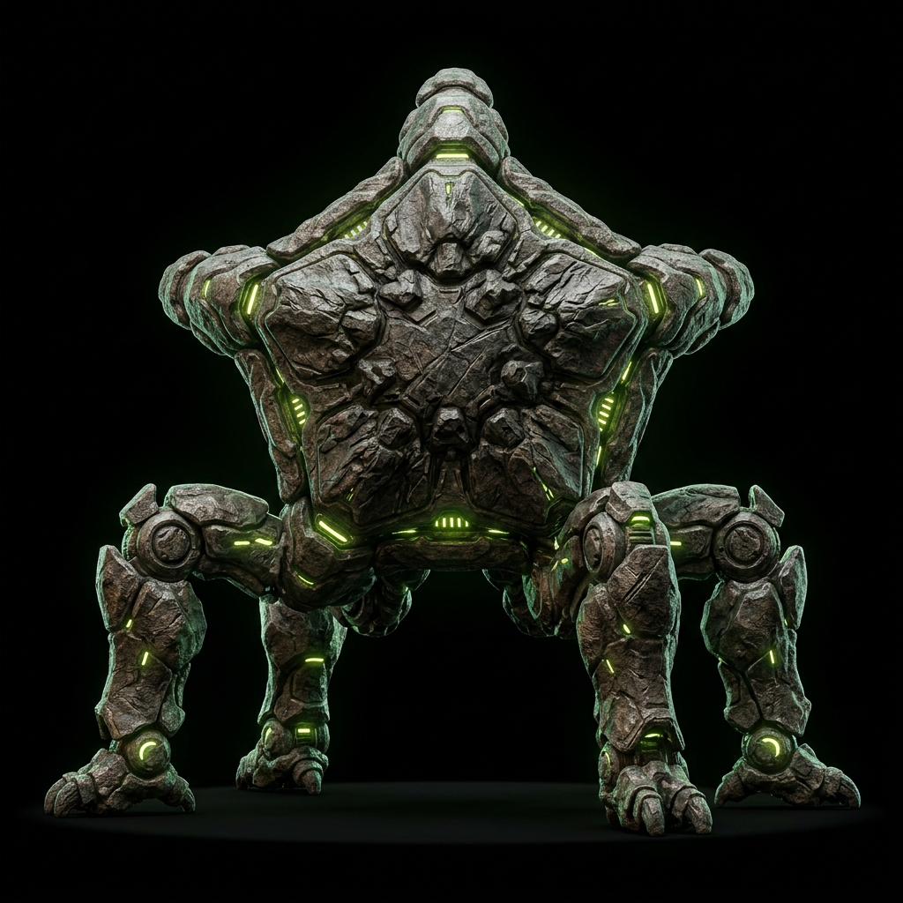

<div align="center">

# 🚀 Hail Mary Distilled

### *A compact sci-fi reasoning assistant — trained to think calmly under uncertainty, inspired by the journey of Dr. Ryland Grace.*

<br />

[](https://huggingface.co/Stinger2311/hail-mary-inspired-student-merged)
[](https://huggingface.co/datasets/Stinger2311/hail-mary-inspired-sci-fi-instruct)
[](LICENSE)
[](https://python.org)

<br />


<br />

<sub>*"I am going to figure this out." — Dr. Ryland Grace*</sub>

</div>

---

## 🌌 Mission Overview

**Hail Mary Distilled** is an end-to-end machine learning project that fine-tunes a compact language model to embody the spirit of calm, scientific reasoning under extreme uncertainty — inspired by Andy Weir's *Project Hail Mary*.

This isn't franchise mimicry. It's a **fully original pipeline** — from hand-crafted instruction data to a deployed model — designed to demonstrate:

<table>
<tr>
<td width="50%">

### 🎯 What It Does
- **Calm reasoning** under incomplete information
- **Honest uncertainty** — says "I don't know" when appropriate
- **Science-literate** communication style
- **Teamwork guidance** for constrained problem-solving
- **Optimistic but measured** responses

</td>
<td width="50%">

### 🔬 Technical Stack
- **Base Model:** Qwen 2.5 · 3B Instruct
- **Method:** QLoRA (4-bit) via Unsloth
- **Rank:** 16 · Alpha: 16
- **Training:** Google Colab (Free Tier!)
- **Dataset:** 30+ hand-crafted + synthetic examples

</td>
</tr>
</table>

---

## 🏗️ Architecture

```
┌─────────────────────────────────────────────────────────────────┐
│                    HAIL MARY DISTILLED PIPELINE                 │
├─────────────────────────────────────────────────────────────────┤
│                                                                 │
│   ┌──────────┐    ┌──────────┐    ┌──────────┐    ┌──────────┐ │
│   │   Seed   │───▶│ Synthetic│───▶│  Review  │───▶│  Merged  │ │
│   │   Data   │    │Expansion │    │ & Filter │    │ Dataset  │ │
│   └──────────┘    └──────────┘    └──────────┘    └──────────┘ │
│        │                                               │       │
│        │              INSTRUCTION DATA                 │       │
│        ▼                                               ▼       │
│   ┌──────────┐                                   ┌──────────┐ │
│   │  Qwen2.5 │         QLoRA Fine-Tune           │   LoRA   │ │
│   │  3B Base │──────────────────────────────────▶│ Adapter  │ │
│   └──────────┘                                   └──────────┘ │
│                                                        │       │
│                                                        ▼       │
│                                                  ┌──────────┐ │
│                                                  │  Merged  │ │
│                                                  │  Model   │ │
│                                                  └──────────┘ │
│                                                        │       │
│                              ┌──────────────────┬──────┘       │
│                              ▼                  ▼              │
│                        ┌──────────┐      ┌──────────┐         │
│                        │   🤗 HF  │      │  Gradio  │         │
│                        │   Hub    │      │   Demo   │         │
│                        └──────────┘      └──────────┘         │
│                                                                 │
└─────────────────────────────────────────────────────────────────┘
```

---

## ⚡ Quick Start

Get running in **under 60 seconds:**

```bash
pip install transformers accelerate safetensors torch
```

```python
from transformers import AutoTokenizer, AutoModelForCausalLM
import torch

model_id = "Stinger2311/hail-mary-inspired-student-merged"

tokenizer = AutoTokenizer.from_pretrained(model_id)
model = AutoModelForCausalLM.from_pretrained(
    model_id,
    dtype=torch.float16,
    device_map="auto",
)

prompt = (
    "System: You are a calm, science-literate assistant. "
    "Be explicit about uncertainty when evidence is incomplete.\n\n"
    "User: How should a crew handle uncertainty during first contact?\n\n"
    "Assistant:"
)

inputs = tokenizer(prompt, return_tensors="pt").to(model.device)
with torch.no_grad():
    out = model.generate(
        **inputs,
        max_new_tokens=180,
        temperature=0.7,
        top_p=0.9,
        do_sample=True,
    )

reply = out[0][inputs["input_ids"].shape[-1]:]
print(tokenizer.decode(reply, skip_special_tokens=True))
```

<details>
<summary><b>💡 Example Output</b></summary>

> *First contact situations inherently involve high uncertainty. The most responsible approach would be to:*
>
> *1. **Observe before acting** — gather as much data as possible before making assumptions about the entity's behavior or intentions.*
> *2. **Communicate uncertainty openly** — ensure every crew member knows what is known, what is speculative, and what is completely unknown.*
> *3. **Establish reversible protocols** — avoid actions that can't be undone. Prioritize gestures of non-aggression that are culturally neutral.*
> *4. **Designate a calm decision-maker** — emotional responses are natural, but decisions should route through someone trained in measured reasoning.*
>
> *It's important to note: we have no empirical precedent for first contact. All frameworks are theoretical.*

</details>

---

## 🗂️ Repository Map

```
hail-mary/
├── 📁 configs/              # Project defaults & training hyperparameters
├── 📁 data/                 # Seed, synthetic, merged datasets & eval prompts
│   ├── seed_dataset.jsonl
│   ├── synthetic_batch_v1.jsonl
│   ├── train_v1_combined.jsonl
│   └── eval_prompts.jsonl
├── 📁 docs/                 # Model card, dataset card, publishing notes
│   ├── model_card.md
│   ├── dataset_card.md
│   └── quick_publish_steps.md
├── 📁 notebooks/            # Colab workflows
│   ├── train_unsloth_colab.ipynb    # Fine-tuning pipeline
│   └── merge_model_colab.ipynb      # Merge & upload
├── 📁 scripts/              # 8 automation utilities
│   ├── validate_dataset.py          # Schema + quality gate
│   ├── merge_datasets.py            # Combine seed + synthetic
│   ├── merge_lora_model.py          # Base + adapter → full model
│   ├── publish_hf_dataset.py        # Push dataset to HF Hub
│   ├── publish_hf_model.py          # Push model to HF Hub
│   ├── prepare_model_repo.py        # Scaffold model repo
│   ├── preview_eval.py              # Quick eval preview
│   └── score_eval_template.py       # Rubric-based scoring
├── 📁 showcase/             # Immersive cinematic showcase site
│   └── index.html, index.css, app.js, assets/
├── 📁 space_demo/           # Gradio demo app template
└── 📄 README.md             # ← You are here
```

---

## 🔧 Training Configuration

<table>
<tr><td><b>Parameter</b></td><td><b>Value</b></td><td><b>Rationale</b></td></tr>
<tr><td>Base Model</td><td><code>Qwen/Qwen2.5-3B-Instruct</code></td><td>Compact, strong instruction-following baseline</td></tr>
<tr><td>Quantization</td><td>4-bit (BnB)</td><td>Fits on free Colab T4 GPU</td></tr>
<tr><td>LoRA Rank</td><td>16</td><td>Balanced expressiveness vs. parameter count</td></tr>
<tr><td>LoRA Alpha</td><td>16</td><td>Standard 1:1 ratio with rank</td></tr>
<tr><td>Target Modules</td><td><code>q_proj, k_proj, v_proj, o_proj, gate_proj, up_proj, down_proj</code></td><td>All 7 attention + FFN projections</td></tr>
<tr><td>Trainable Params</td><td>~0.5% of total</td><td>Efficient fine-tuning, minimal catastrophic forgetting</td></tr>
<tr><td>Framework</td><td>Unsloth + PEFT</td><td>2× faster training on consumer hardware</td></tr>
<tr><td>Compute</td><td>Google Colab Free (T4)</td><td>Zero-cost, fully reproducible</td></tr>
</table>

---

## 🛠️ Maintainer Commands

<details>
<summary><b>📋 Dataset Operations</b></summary>

**Validate a dataset file:**
```bash
python scripts/validate_dataset.py data/seed_dataset.jsonl
```

**Merge seed + synthetic datasets:**
```bash
python scripts/merge_datasets.py \
  data/seed_dataset.jsonl \
  data/synthetic_batch_v1.jsonl \
  data/train_v1_combined.jsonl

python scripts/validate_dataset.py data/train_v1_combined.jsonl
```

</details>

<details>
<summary><b>🧬 Model Operations</b></summary>

**Merge LoRA adapter into full model:**
```bash
python scripts/merge_lora_model.py \
  --base-model Qwen/Qwen2.5-3B-Instruct \
  --adapter Stinger2311/hail-mary-inspired-student-lora \
  --output-dir outputs/hail_mary_merged_model \
  --push-repo-id Stinger2311/hail-mary-inspired-student-merged
```

**Publish model to HuggingFace:**
```bash
python scripts/publish_hf_model.py
```

**Publish dataset to HuggingFace:**
```bash
python scripts/publish_hf_dataset.py
```

</details>

---

## 📊 Live Assets

| Asset | Status | Link |
|:------|:------:|:-----|
| 🔗 **Source Code** | ✅ Live | [GitHub Repository](https://github.com/Chandan062311/Hail-Mary) |
| 🤗 **LoRA Adapter** | ✅ Live | [hail-mary-inspired-student-lora](https://huggingface.co/Stinger2311/hail-mary-inspired-student-lora) |
| 🤗 **Merged Model** | ✅ Live | [hail-mary-inspired-student-merged](https://huggingface.co/Stinger2311/hail-mary-inspired-student-merged) |
| 📦 **Dataset** | ✅ Live | [hail-mary-inspired-sci-fi-instruct](https://huggingface.co/datasets/Stinger2311/hail-mary-inspired-sci-fi-instruct) |
| 🎮 **Demo Space** | ⏸️ Paused | [hail-mary-demo-chat](https://huggingface.co/spaces/Stinger2311/hail-mary-demo-chat) |
| 🌌 **Showcase Site** | ✅ Live | [Immersive Mission Control](showcase/) |

---

## 📓 Notebooks

| Notebook | Purpose | Platform |
|:---------|:--------|:---------|
| [`train_unsloth_colab.ipynb`](notebooks/train_unsloth_colab.ipynb) | Full QLoRA fine-tuning workflow | Google Colab (Free T4) |
| [`merge_model_colab.ipynb`](notebooks/merge_model_colab.ipynb) | Merge adapter → full model + upload | Google Colab (Free T4) |

---

## 🔍 Troubleshooting

<details>
<summary><b>⚠️ Colab: <code>HF_TOKEN</code> not found</b></summary>

Public model downloads still work without a token. For higher rate limits or private repos:

```python
from huggingface_hub import notebook_login
notebook_login()
```

</details>

<details>
<summary><b>⚠️ Space startup fails</b></summary>

Ensure your `space_demo/` config is correct:
- `README.md` includes `python_version: "3.10"`
- `requirements.txt` pins `gradio==4.44.1` and `huggingface_hub==0.25.2`
- `app.py` does **not** pass unsupported args like `flagging_mode` to `gr.Interface()`

Then: **Settings → Factory reboot**

</details>

<details>
<summary><b>⚠️ Space stuck in BUILDING</b></summary>

On free `cpu-basic`, queue delays are common:
1. Wait 10–30 minutes
2. Try a **Factory reboot**
3. Pause → Restart the space

</details>

---

## ⚖️ Responsible Use

> [!IMPORTANT]
> This project is **educational and portfolio-oriented.** It is inspired by themes from Andy Weir's *Project Hail Mary*, not trained on licensed source text.

- ❌ Do **not** use outputs as authoritative in high-stakes contexts
- ❌ Do **not** imply official franchise affiliation
- ✅ Designed for learning, experimentation, and portfolio demonstration
- ✅ All training data is original or synthetically generated

---

## 📚 Documentation

| Document | Description |
|:---------|:------------|
| [`docs/model_card.md`](docs/model_card.md) | Model specifications, limitations, and intended use |
| [`docs/dataset_card.md`](docs/dataset_card.md) | Dataset construction methodology and statistics |
| [`docs/quick_publish_steps.md`](docs/quick_publish_steps.md) | Step-by-step HuggingFace publishing guide |
| [`docs/huggingface_cleanup_and_dataset.md`](docs/huggingface_cleanup_and_dataset.md) | Hub maintenance and dataset management |

---

<div align="center">



### *♪♫ Good good good! You read whole README! Amaze, friend!*

<br />

**Built with 🧬 + ☕ on a free Colab GPU**

*Inspired by Project Hail Mary by Andy Weir*

<br />

[](https://github.com/Chandan062311/Hail-Mary)

</div>
